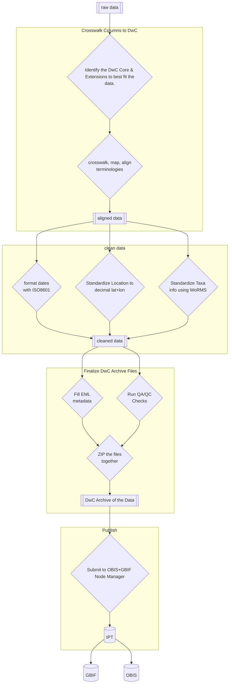

This is a reproduction of Ben Best's overview of the Biodata Mobilization Workshop process [[ref](https://ioos.github.io/bio_mobilization_workshop/about/)].

```mermaid
graph TD

DATA[["raw" data]]  
DATA --> SCHEMA

subgraph Crosswalk Columns to DwC
  SCHEMA{Identify the DwC Core & \n Extensions to best fit the data.}
  --> ALIGN{crosswalk, map, align \n terminologies}
  --> ALIGNED[["aligned" data]]
end
ALIGNED --> DATE
ALIGNED --> LOC
ALIGNED --> TAXA

subgraph clean data 
  DATE{format dates \n with ISO8601}
  LOC{Standardize Location to \n decimal lat+lon}
  TAXA{Standardize Taxa \n info using WoRMS}
  CLEANED[["cleaned" data]]
  DATE --> CLEANED
  LOC  --> CLEANED
  TAXA  --> CLEANED
end
CLEANED --> META
CLEANED --> QC
subgraph Finalize DwC Archive Files
  META{Fill EML \n metadata}
  QC{Run QA/QC \n Checks}
  META --> ZIP
  QC --> ZIP
  ZIP{ZIP the files \n together}
  --> DWC[["DwC Archive" of the Data]]
end
DWC --> SUBMIT
subgraph Publish
   SUBMIT{Submit to OBIS+GBIF Node Manager}
   --> IPT[(IPT)]
end
IPT --> GBIF[(GBIF)]
IPT --> OBIS[(OBIS)]

```
