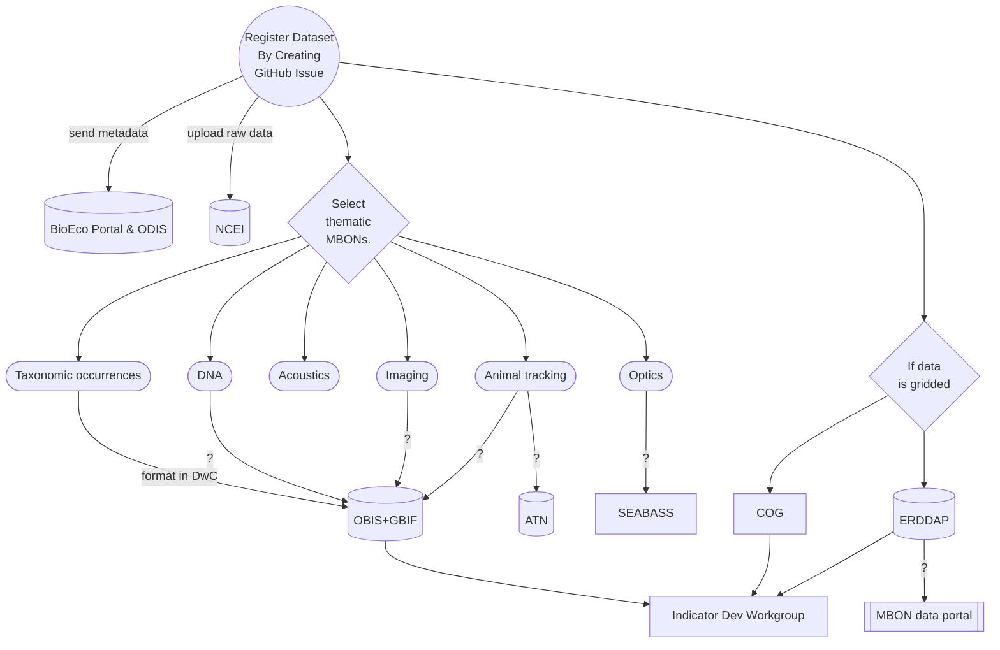

```mermaid

graph TD

REGISTER((Register Dataset \n By Creating \n GitHub Issue)) 
  -- send metadata --> BIOECO[(BioEco Portal & ODIS)]

%% REGISTER --> REGIONAL{Select \n regional MBONs.}

REGISTER -- upload raw data --> NCEI[(NCEI)]

REGISTER --> THEMATIC{Select \n thematic \n MBONs.} 

THEMATIC --> TAXA([Taxonomic occurrences])
  TAXA -- format in DwC --> DWC[(OBIS+GBIF)]
  %% DWC --> OBIS
  %% DWC --> GBIF
THEMATIC --> DNA([DNA])
  DNA -- ? --> DWC
THEMATIC --> ACOUSTICS([Acoustics])
  %% ACOUSTICS --> PASSIVE[passive]
  %% ACOUSTICS --> ACTIVE[active]
THEMATIC --> IMAGE([Imaging])
  IMAGE -- ? --> DWC
THEMATIC --> TRACKING([Animal tracking])
  TRACKING -- ? --> ATN[(ATN)]
  TRACKING -- ? --> DWC
THEMATIC --> OPTICAL([Optics])
  OPTICAL -- ? --> SEABASS
REGISTER --> IF_GRIDDED{If data \n is gridded}
IF_GRIDDED --> ERDDAP[(ERDDAP)]
IF_GRIDDED --> COG

ERDDAP -- ? --> PORTAL[[MBON data portal]]

DWC --> INDICATORS
COG --> INDICATORS
ERDDAP --> INDICATORS

INDICATORS[Indicator Dev Workgroup]

click REGISTER "https://github.com/marinebon/dataset-registry/issues"

```
