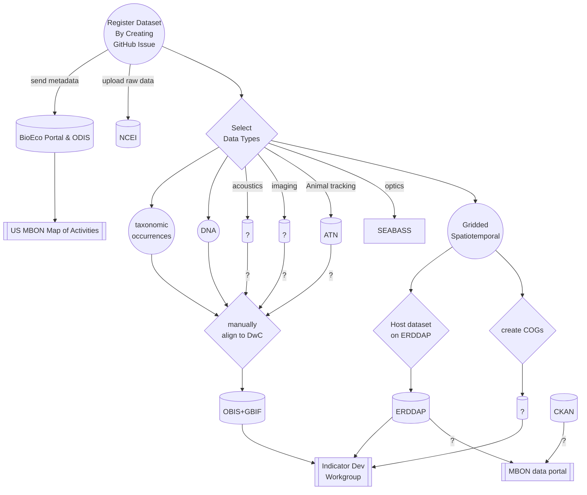

```mermaid

graph TD

REGISTER((Register Dataset \n By Creating \n GitHub Issue)) 
  -- send metadata --> BIOECO[(BioEco Portal & ODIS)]

BIOECO --> MAP[[US MBON Map of Activities]]

%% REGISTER --> REGIONAL{Select \n regional MBONs.}

REGISTER -- upload raw data --> NCEI[(NCEI)]

REGISTER --> THEMATIC{Select \n Data Types} 

THEMATIC --> TAXA((taxonomic \n occurrences)) 
  --> DWC_ALIGN{manually \n align to DwC} 
  --> DWC[(OBIS+GBIF)]
THEMATIC --> DNA((DNA)) 
  --> DWC_ALIGN
THEMATIC -- acoustics --> ACOUSTICS_DB[(?)]
  -- ? --> DWC_ALIGN
THEMATIC -- imaging --> IMAGE_DB[(?)]
  -- ? --> DWC_ALIGN
THEMATIC -- Animal tracking --> ATN[(ATN)]
  -- ? --> DWC_ALIGN
THEMATIC -- optics --> SEABASS
THEMATIC --> GRIDDED((Gridded \n Spatiotemporal))
GRIDDED --> ERDDAP_FMT{Host dataset \n on ERDDAP} 
  --> ERDDAP[(ERDDAP)]
GRIDDED --> COG{create COGs} --> COG_DB[(?)]
  --> INDICATORS

DWC --> INDICATORS
ERDDAP --> INDICATORS
INDICATORS[[Indicator Dev \n Workgroup]]

CKAN[(CKAN)] -- ? --> PORTAL
ERDDAP -- ? --> PORTAL[[MBON data portal]]

click MAP "https://github.com/marinebon/map-of-activities"
click REGISTER "https://github.com/marinebon/dataset-registry/issues"
click DWC_ALIGN "https://ioos.github.io/mbon-docs/mbon-data-flow.html#darwin-core-alignment"

```
